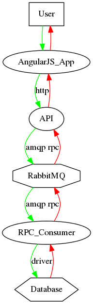

# Ride Share Market Devops

ridesharemarket.com - Free, Accessible and Opensource Ride Sharing.

This git repository is the Chef Configuration Management Policy for ridesharemarket.com.

You are welcome to view all the code, though sensitive data like passwords and API keys are encrypted for security.

This code base is under active development so this readme and further documentation will be added.

If you have any questions or wish to contribute you may contact us direct at systemsadmin@ridesharemarket.com.

